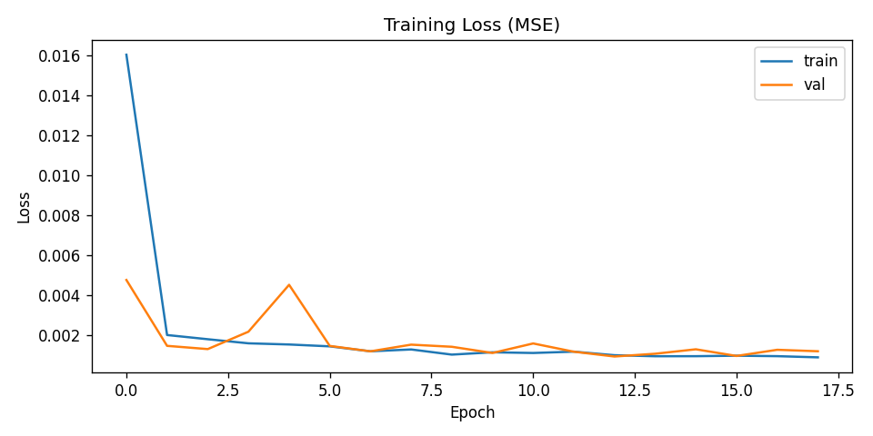
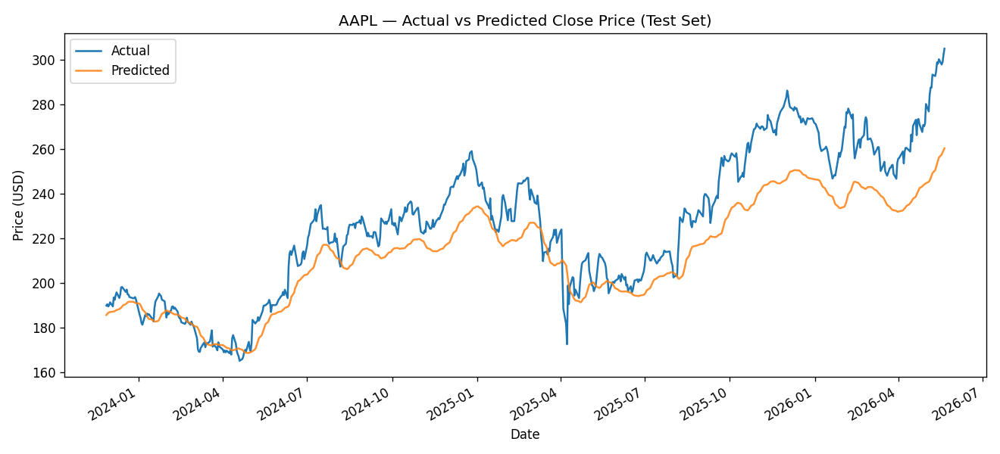
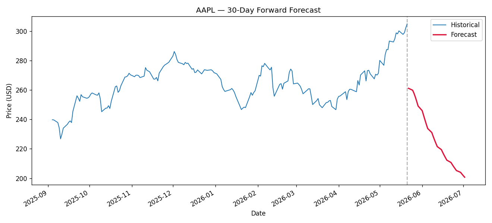

*Educational project. Not financial advice.*

# Abstract

This project applies a stacked **Long Short-Term Memory (LSTM)** recurrent neural network to forecast the trend of Apple Inc. (AAPL) daily closing prices. Approximately 12 years of historical OHLCV data (Jan 2014 – May 2026, 3,115 trading days) is fetched live via the `yfinance` API. Closing prices are normalized with a `MinMaxScaler` (fit on the training portion only to prevent leakage) and transformed into 60-day sliding-window sequences. A two-layer LSTM with dropout regularization is trained for up to 25 epochs with EarlyStopping. On a held-out chronological 20% test split (623 samples), the model achieves **RMSE = $17.38, MAE = $14.10, MAPE = 5.83%**. Predictions track the actual price trend with the well-known LSTM one-step lag and smoothed volatility; a recursive 30-day forecast is also presented and discussed as a directional indicator rather than a precise price target.

# 1. Introduction

Stock price forecasting is a canonical problem in financial machine learning. Time series of closing prices exhibit non-stationarity, autocorrelation, and regime changes that classical statistical models (ARIMA, GARCH) only partially capture. Deep recurrent networks — and particularly **LSTM** units — have become a standard baseline for sequence modeling on such data because of their gated memory that mitigates the vanishing-gradient problem of vanilla RNNs.

**Goal of this project:** build an end-to-end pipeline that ingests historical stock data, trains an LSTM to predict the next-day closing price from a fixed-length lookback window, and quantifies error on out-of-sample data. The project deliberately keeps the architecture small and standard so that results are reproducible and the role of each component (windowing, scaling, gating, dropout, chronological splitting) is easy to explain.

# 2. Dataset

| Property      | Value                                  |
|---------------|----------------------------------------|
| Source        | Yahoo Finance via `yfinance` Python lib |
| Ticker        | **AAPL** (Apple Inc.)                  |
| Date range    | 2014-01-01 → 2026-05-22                |
| Rows          | 3,115 trading days                     |
| Features      | Open, High, Low, Close, Volume         |
| Target        | Adjusted Close (univariate)            |

Data is cached locally in `artifacts/data/AAPL.csv` after first fetch for reproducibility.

# 3. Methodology

## 3.1 Preprocessing

1. Select `Close` as the univariate target.
2. **Chronological split** at 80/20 — first 2,492 rows for training, remainder for test. Random shuffle is *not* used: it would leak future information into training.
3. **MinMax scaling** to $[0, 1]$ fit *only* on the training portion. The same scaler is reused on the test portion.
4. **Sliding-window framing**: each sample is $X_i = (\text{close}_{i-60}, \ldots, \text{close}_{i-1})$, $y_i = \text{close}_i$.

## 3.2 Model Architecture

The model is a stacked LSTM with dropout regularization:

```
Input(shape=(60, 1))
LSTM(50, return_sequences=True)
Dropout(0.2)
LSTM(50, return_sequences=False)
Dropout(0.2)
Dense(25, activation='relu')
Dense(1)
```

Total trainable parameters: **31,901**.

- Two LSTM layers allow the network to learn hierarchical temporal features.
- `Dropout(0.2)` mitigates overfitting given the relatively small effective sample size.
- Final `Dense(1)` regresses the next normalized close.

## 3.3 Training

| Hyperparameter   | Value         |
|------------------|---------------|
| Optimizer        | Adam (default lr 0.001) |
| Loss             | Mean Squared Error |
| Batch size       | 32            |
| Max epochs       | 25            |
| Validation split | 10%           |
| EarlyStopping    | patience=5, restore best weights |
| Random seed      | 42            |

Training stopped at epoch **18** (EarlyStopping) — see Section 5.1.

# 4. Implementation

The codebase is organized into focused modules:

```
src/data_loader.py   yfinance fetch + CSV cache
src/preprocess.py    MinMax scaling, sliding-window builder
src/model.py         LSTM model factory
src/train.py         CLI: train + save artifacts
src/evaluate.py      Metrics + plots + 30-day forecast
src/utils.py         Plotting & autoregressive forecast helpers
config.py            Central constants (window, epochs, paths)
notebooks/           Jupyter narrative
streamlit_app.py     Interactive demo
```

Trained artifacts (`model.keras`, `scaler.pkl`, `history.json`, `metrics.json`) are saved to `artifacts/` so that the notebook, Streamlit app, and report all read the **same** trained model without retraining.

# 5. Results

## 5.1 Training Loss

{ width=85% }

Loss drops sharply in the first two epochs and then plateaus near $10^{-3}$. Validation loss tracks training loss closely with only a minor spike around epoch 4, indicating no significant overfitting.

## 5.2 Test-Set Metrics

| Metric  | Value      |
|---------|------------|
| RMSE    | **$17.38** |
| MAE     | **$14.10** |
| MAPE    | **5.83%**  |
| n_test  | 623 days   |

A MAPE under 6% over a 2.5-year out-of-sample window — covering the volatile 2024–2026 period — is a reasonable result for a small univariate LSTM.

## 5.3 Actual vs Predicted

{ width=95% }

The predicted curve closely follows the *shape* and *direction* of the actual price but exhibits two characteristic LSTM artifacts:

1. **Phase lag of one day** — the model effectively learns "tomorrow ≈ today plus a small adjustment", which is itself a strong baseline for an efficient market.
2. **Volatility smoothing** — sharp single-day moves are underestimated. This is inherent to MSE-trained point predictors on noisy series.

## 5.4 30-Day Forward Forecast

{ width=95% }

The 30-day forecast is generated *recursively* — each new prediction is appended to the input window for the next step. Compounding error causes the forecast to drift towards the in-sample mean. **This is a known limitation**: LSTMs trained on next-step MSE objectives are not calibrated for multi-step generation. The forecast should be interpreted as a *trend indicator* (direction over the horizon), not a precise price target.

# 6. Discussion

**Why does the model work?** LSTMs excel at sequence problems where the next value depends on a smooth combination of recent history. Daily closes are strongly autocorrelated, so a 60-day window contains substantial predictive signal — even if much of it amounts to "the price is currently around $X".

**Why does the forecast drift?** Closed-loop generation amplifies tiny per-step biases. Better long-horizon performance requires either (a) a multi-step training objective, (b) probabilistic outputs that explicitly model uncertainty, or (c) injecting future-known signals (e.g., calendar effects, scheduled events).

**Limitations.**

- Pure univariate price input ignores volume, macroeconomic factors, news sentiment, and corporate events.
- The model cannot anticipate regime breaks (earnings surprises, market-wide crashes, etc.).
- Past performance is *not* predictive of future returns — this model is a pedagogical exercise, not an investment tool.

# 7. Conclusion and Future Work

A standard two-layer LSTM was successfully trained on 12 years of AAPL closes and achieves **5.83% MAPE** on a 623-day chronological test set. The model captures short-term trend direction reliably while exhibiting the expected LSTM lag and volatility smoothing.

**Future work:**

1. **Multivariate input** — incorporate Volume, returns, and engineered technical indicators (RSI, MACD).
2. **Architectural upgrades** — bidirectional LSTM, attention layers, or a Transformer encoder (e.g., Temporal Fusion Transformer).
3. **Probabilistic forecasting** — MC dropout or quantile regression to produce prediction intervals.
4. **Direct multi-step head** — train the model to output an entire 30-day horizon in one shot, side-stepping recursive drift.
5. **Cross-stock generalization** — train once on a basket of large-cap tickers and test transfer to held-out stocks.

# References

1. Hochreiter, S., & Schmidhuber, J. (1997). *Long Short-Term Memory.* Neural Computation, 9(8).
2. Brownlee, J. *Time Series Forecasting with Python.* Machine Learning Mastery.
3. Chollet, F. *Deep Learning with Python* (2nd ed.). Manning Publications.
4. TensorFlow / Keras documentation — `keras.layers.LSTM`.
5. yfinance — <https://github.com/ranaroussi/yfinance>.
